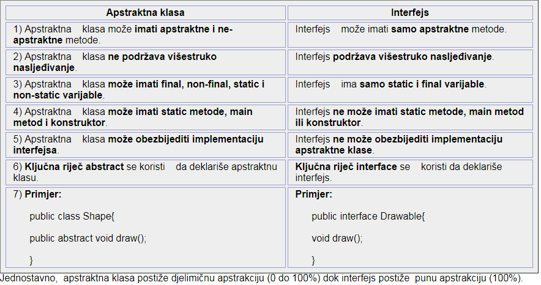

# OOP principi i Java

## **Šta je objekat, šta je klasa, i veza između ta dva pojma?**

- Klasa predstavlja generalizovani opis grupe entiteta.Dobija se procesom apstrakcije čiji je cilj da na osnovu posmatranja konkretnih entiteta definiše zajedničku kategoriju kojom bi se svi posmatrani entiteti da se opišu.Klase se dizajniraju tako da sadrže sve najbitnije osobine entiteta.Klasa predstavlja model objekta i uključuje atribute i metode.U Javi je sve predstavljeno klasama, sve što napišemo (metode,promenljive…) mora se naći u okviru neke klasenije tj. moguće definisati funkcije i promenljive izvan neke klase.I main metoda se nalazi u nekoj klasi!!! Listing za definisanje klase počinje ključnom reči class .

- Instance klasa se zovu objekti.Objekti se kreiraju upotrebom ključne reči new.Za čuvanje kreiranih objekata koristi se heap. Na heap-u se zauzima (alocira) memorija za objekat, dok se referenca (oznaka memorijske lokacije) ka objektu čuva kao vrednost promenljive na stack-u..Entiteti se modeluju klasama, a instanciranjem tih klasa nastaju objekti.Osnovna klasa za sve objekte u Javi je klasa Object.Sve Java klase direktno ili indirektno nasleđuju klasu Object.Objekti klase String se ne mogu menjati (immutable)!Immutable Objects je objekat kome se definiše vrednost u trenutku njegovog kreiranja. Za njega ne postoje metode, ni načini kako da se ta vrednost dodatno promeni.

## **koji su osnovni principi OOP i objasni ih?**

- Termin object-oriented programming (OOP) predstavlja način razmišljana za rešavanje programerskih problema.Srž ovog načina razmišljanja čini koncept objekta.Objektno orijentisano programiranje se svodi na identifikaciju entiteta u nekom domenu, navođenje njihovih osobina i pisanje operacija nad tim osobinama. U objektno orijentisanoj terminologiji, entiteti su opisani klasama, osobine su atributi, a operacije su metode.

- Onsnovni principi OOP:
    1. Apstrakcija
    2. Enkapsulacija
    3. Polimorfizam
    4. Nasledjivanje

- **Apstrakcija** je proces skrivanja detalja implementacije i pokazivanja korisniku samo funkcionalnosti.
 Drugim riječima, korisniku se pokazuju samo važne stvari, a unutrašnji detalji ostaju skriveni. Napr. pri slanju sms-a, mi samo kucamo tekst i šaljemo poruku. Nije nam poznato interno procesiranje vezano za slanje poruke. Apstrakcija nam dopušta da se fokusiramo na to što objekt radi umjesto na kako to radi.

- **Polimorfizam** u Javi je koncept pomoću kojeg možemo izvesti jednu akciju na različite načine. Riječ polimorfizam se izvodi iz dve grčke riječi: poly i morphe. Riječ "poly" znači više, a "morphe" znači oblik. Dakle, polimorfizam znači više oblika.

## **Šta je princip enkapsulacija?**

- **Enkapsulacija u javi** je _proces pakovanja koda i podataka zajedno u jedinstvenu jedinicu_, kao što se napr. različiti lijekovi mogu pomiješati u jednoj kapsuli.
Možemo kreirati potpuno enkapsuliranu klasu u javi tako što ćemo učiniti sve podatke-članove klase private. Tada možemo koristiti seter i geter metode za podešavanje i pristup podacima u njoj.

## **Princip nasleđivanja (detaljno)? Navesti primere**

- Ključna reč extends.Relacija nasleđivanja omogućuje proširenje ponašanja postojeće klase. Generalizacija – Entiteti sa zajedničkim osobinama se grupišu tako da se njihove zajedničke osobine definišu samo jednom u osnovnoj klasi koja predstavlja njihovu generalizaciju. Specijalizacija – Sve ostale osobine entiteta koji su karakteristične za svaki posmatrani entitet se definišu u zasebnim klasama koje nasleđuju osnovnu klasu, te nove klase predstavljaju specijalizaciju entiteta osnovnih klasa.Nasleđivanje je relacija generalizacije odnosno specijalizacije između dve klase. Kažemo da klasa naslednica proširuje funkcionalnost klase pretka, odnosno predstavlja užu kategoriju klase pretka. Na primer, imamo klase Vozilo, Automobil i Kamion. Automobil je vozilo koje dodatno opisujemo brojem putnika, brojem vrata, i slično, dok je Kamion vozilo koje dodatno opisujemo atributima ao što su nosivost. U tom slučaju, klase Kamion i Automobil nasleđuju klasu Vozilo. NasljeđivanjeuJavijemehanizamukojemjedanobjektdobijasveosobineiponašanjaroditeljskogobjekta. IdejakojastojiizanasljeđivanjauJavijetadasemogukreiratinoveklasekojesuizgrađenenapostojećimklasama. Kadasenasljeđujeizpostojećeklase, mogućejeponovoupotrijebitimetodeipoljaroditeljskeklase, atakođejemogućedodatinovemetodeipolja. NasljeđivanjepredstavljaIS-Arelaciju, takođepoznatuikaorelacijaRoditelj-Dijete. **Zbog čega se koristi nasljeđivanje?** zbog preklapanja (overriding) metoda (takođe i polimorfizma u vremenu izvršavanja);zbog ponovne upotrebljivosti (reusability) koda.

## **Konstruktori (šta su, kako izgledaju u kodu, koji postoje)?**

-Ako ne napravimo konstruktor, kompajler će sam napraviti defaultkonstruktor, koji ništa ne radi.Taj konstruktor se neće kreirati na nivou izvornog koda, već na nivou bajt-koda (prevedenog koda).U konstruktoru inicijalizujemo atribute koji bi trebalo da su inicijalizovani.Konstruktor može primati i parametre.Kako je konstruktor metoda klase možemo da napravimo proizvoljan broj konstruktora sve dok se oni razlikuju po broju i tipu parametara.Ukoliko se u klasi napiše barem jedan konstruktor, tada podrazumevani konstruktor više ne postoji.Konstruktor se automatski poziva prilikom kreiranja objekta.

```code
int sifraRacuna;
double stanje;
Klijent k;

RacunUBanci() {} //konstrukor bez parametara

RacunUBanci(int sifraRacuna, double stanje) {
    this.sifraRacuna=sifraRacuna;
    this.stanje=stanje;
} //konstrukor sa 2 parametara

RacunUBanci(int sifraRacuna, double stanje, Klijent k) {
    this.sifraRacuna=sifraRacuna;
    this.stanje=stanje;
    this.k=k;
} //konstruktor sa 3 parametra
```

## **Zašto postoje modifikatori pristupa? Gde se sve navode modifikatori pristupa? Koji su modifikatori pristupa u Javi?**

- Ponekad je potrebno obezbediti kontrolisan pristup atributima, kako za čitanje, tako i za pisanje. Tada se koriste se modifikatori pristupa. **public** -vidljiv za sve klase, **protected** -vidljiv samo za klase naslednice i klase iz istog paketa, **private** -vidljiv samo unutar svoje klase, **nespecificiran** (package-private)-vidljiv samo za klase iz istog paketa.Modifikatori pristupa se navode ispred definicija klasa, metoda i atributa.Kada atributima i metodama odredimo i napišemo modifikatore pristupa, dobija se klasa kojoj je omoguće kontrolisani pristup iz dugih klasa i programa.

## **Šta je properti?**

- Kombinacija nevidljivog atributa i vidljivih get i set metoda naziva se svojstvo (property).Ovim je omogućeno da se čitanje vrednosti svojstva samo sprovodi kroz njegov getter, a izmena samo kroz setter.Ako izostavimo setter, dobijamo read only svojstvo.

## **Apstraktne klase, šta su, da li apstraktna klasa mora da ima apstraktne metode, da li apstraktna klasa može da nasledi apstraktnu klasu? Navesti primer apstraktne klase**

- Osnovna klasa koja nema nijedan konkretan (realan) objekat, već samo predstavlja generalizaciju izvedenih klasa, naziva se apstraktnom klasom. Apstraktna klasa može da sadrži apstraktne funkcije, koje su u ovoj klasi samo deklarisane, a nije implementirane. Klase koje ne mogu imati svoje objekte, već samo njene klase naslednice mogu da imaju objekte (ako i one nisu apstraktne).Ako klasa ima makar jednu apstraktnu metodu, mora da se deklariše kao apstraktna. Apstraktna klasa ne mora da ima apstraktne metode!

```code
public abstract class Vozilo {
    private String naziv;
    public abstract void vozi();
}

public class Automobil extends Vozilo {
    public boolean radi;

    public void upali() {
        radi = true;
    }

    public void ugasi() {
        radi = false;
    }

    @Override
    public void vozi() {
        ...
    }
}
```

## **Šta su interfejsi,** **razlika između interfejsa (u javi 1.7 i javi 1.8)****?**

- Omogućavaju definisanje samo apstraktnih metoda, konstanti i statičkih atributa. Ključna reč implements. Interfejs nije klasa! On je spisak metoda i atributa koje klasa koja implementira interfejs mora da poseduje. Interfejsi se ne nasleđuju, već implementiraju. Da bi klasa implementirala interfejs, mora da redefiniše sve njegove metode. Jedan interfejs može da nasledi drugog. Sve metode su implicitno public, a svi atributi su implicitno public static final.Jedna klasa može da implementira jedan … ili više interfejsa.

**Java 1.8 uvodi funkcionalan interfejs koji moze imati samo 1 metodu.**

## **Ključna reč** _ **static** _ **, šta omogućava, detaljno o statičkim atributima i metodama?**

-Definiše statičke atribute i metode.Vezuju se za klasu, a ne za objekat klase Vrednost atibuta se na čuva u objektima, već se skladišti u Field Data prostoru koji se nalazi u Class Data (prostor namenjen za skladištenje metapodataka i informacija za klasu) koji pripada prostoru Method Area koji pripada delu memorije Metaspace. Statički atributi i metode postoje i bez kreiranje objekta zato im se treba pristupiti preko imena klase StaticTest.i++; Statički atributi imaju istu vrednost u svim objektima Ako promenim statički atribut u jednom objektu, on će se promeniti i kod svih ostalih objekata.Namena statičkih metoda: pristup i rad sa statičkim atributima; opšte metode za koje nije potrebno da se kreira objekat.

## **Opiši statički blok (šta je, kada se poziva, pre ili posle konstruktora)?**

- Statički blok se izvršava samo jednom, prilikom prvog korišćenja klase. Unutar statičkog bloka može se pristupati samo statičkim atributima i mogu se pozivati samo statičke metode.

```code
class Test {
    static int a;
    static int b;
    int c;

    static void f() {
        b = 6;
    }

    static {
        a = 5;
        //c = 1; //zabranjeno
        f();
    }
}
```

## **Ključna reč** _ **final** _ **, gde se sve koristi/ispred čega navodi i šta znači u različitim scenarijima upotrebe?**

- Ako napišemo ključna reč final ispred naziva klase nasleđivanje je zabranjeno.Promenljive čija vrednost se ne može menjati .NPR final int a = 55;

## **Razlika između apstraktnih klasa i interfejsa?**

- Apstraktna klasa i interfejs se koriste za postizanje apstrakcije gdje možemo deklarisati apstraktne metode. Apstraktna klasa i interfejs se ne mogu instancirati.Ali postoje mnoge razlike između apstraktne klase i interfejsa koje su date u sljedećoj tabeli.



## **Polimorfizam, šta je, šta nam omogućava i koji postoji, opiši ih i navesti primere?**

- Opisuje koncept u kome se određena akcija može izvršiti na više načina. Polymorphism je nastao kombinacijom grčkih reči poly (više) i morphs (izgled/forma) Može biti:**A)**compile time polymorphism (implementira sa method overloading) **B)**runtime polymorphism (implementira sa method overriding)

- Naglasak na Runtime polymorphism koji se još zove Dynamic Method Dispatch.Situacija kada se poziva metoda nekog objekta, a ne zna se unapred kakav je to konkretan objekat. ono što se zna je koja mu je bazna klasa. Tada je moguće u programu pozivati metode bazne klase, a da se zapravo pozivaju metode konkretne klase koja nasleđuje baznu klasu.Prednost korišćenja polimorfizma ogleda se u toma da nam on omogućava kreiranje uniformnog pristupa/kontrole ka različitim objektima koji imaju zajednički podskup operacija. Rezultat polimorfizma je kod koji je više koncizan i lakši za održavanje.

```code
abstract class Vozilo {
    abstract void vozi();
}

class Automobil extends Vozilo {
    @Override
    void vozi() {
        ...
    }
}

class Kamion extends Vozilo {
    @Override
    void vozi() {
        ...
    }
}

class Vozac {
    void vozi(Vozilo v) {
        v.vozi();
    }
}

...

Vozac v = new Vozac();

v.vozi(new Automobil()); // ovde mozemo da prosledimo instancu Automobil jer nasledjuje Vozilo
```

## **Kako se implementira Compile time polimorfizam?**

- compile time polymorphism (implementira sa method overloading). Za vreme kompajliranja zna se koji se metod poziva na osnovu argumenata

## **Kako se implementira runtime polymorphism?**

- runtime polymorphism (implementira sa method overriding). Kompajler ne određuje koja konkretna implementacija metoda će biti pozvana. Implementacija se određuje za vreme izvršavanja u zavisnosti od toga koji je konkretan objekat instanciran.

- Naglasak: Runtime polymorphism se još zove Dynamic Method Dispatch.

## **Dinamičko (late binding) i statičko(early binding) povezivanje?**

- Povezivanje poziva funkcije sa odgovarajućim telom metode (implementacijom) se naziva binding.

- Static binding: kada je tip objekta određen za vreme kompajliranja. Kada je poziv metode određen za vreme kompajliranje (konkretna implementacija metoda zna za vreme kompajliranja).Koristi informacije o tipu objekta. Sve metode deklarisane kao static, private ili final se sigurno određene za vreme kompajliranje (ne mogu da se redefinišu).Statičko povezivanje odnosi se slučaj kada se zna koja će konkretna implementacija metoda biti pozvana još za vreme kompajliranja.

- Dynamic binding: kada se konkretan tip objekta određuje za vreme izvršavanja.Kada je poziv metode određuje za vreme izvršavanja (konkretnaimplementacija metoda nije poznata za vreme kompajliranja i određuje se zavreme izvršavanja, pogledati primer ).Koristi konkretne objekte.Dinamičko povezivanje odnosi se na slučaj kada konkretna implementacijametoda nije poznata za vreme kompajliranja i određuje se za vremeizvršavanja (pogledati primer polimorfizma za vreme izvršavanja)

## **Ključna reč super, šta omogućuje, gde se sve može pozvati?**

- Ključna reč super označava roditeljsku klasu. Ona se može koristiti i u metodama i u konstruktorima. Ključna reč super u konstruktoru označava da pozivamo konstruktor roditeljske klase. Prva linija u konstruktoru klase naslednice mora biti poziv konstruktora roditeljske klase. Korišćenjem reči super možemo pristupiti metodama roditeljske klase koje su redefinisane

## **Redosled pozivanja konstruktora kod nasleđivanja?**

- Ako ne napravimo konstruktor, kompajler će sam napraviti default konstruktor, koji ništa ne radi. Taj konstruktor se neće kreirati na nivou izvornog koda, već na nivou bajt-koda (prevedenog koda). U konstruktoru inicijalizujemo atribute koji bi trebalo da su inicijalizovani.Konstruktor može primati i parametre. Kako je konstruktor metoda klase možemo da napravimo proizvoljan broj konstruktora sve dok se oni razlikuju po broju i tipu parametara. Ukoliko se u klasi napiše barem jedan konstruktor, tada podrazumevani konstruktor više ne postoji.Objekti – pozivanje konstruktora.

## **Šta je metoda i čemu služi?**

- Motivacija : ponavljanje koda; dekompozicija na manje celine **Osnovni elementi:** definicija; poziv

- Metode: funkcije i procedure;

- Parametri mogu biti:primitivni tipovi; reference na objekte Rezultat može biti:primitivni tip;referenca na objekat. Parametri metoda se u nekim programskim jezicima prenose po vrednosti ili po referenci u programskom jeziku Java, prenos je isključivo po vrednosti. Rekurzija: metoda poziva samu sebe.Svaka rekurzivna metoda mora da ima uslov za izlaz iz rekurzije!Pozitivno:razumljivije ponekad i jedino moguće(Akermanova funkcija) Mana:opterećuje stek,brzina.Može se ukratko reći da metode definišu pristup podacima u većini klasa.

## **Opis definicije i tela metode? šta mora da se poklopi? gde ne sme da bude kod?**

- sintaksa: povratn\_tip ime\_metode(parametri) {...}

- Povratni tip je bilo koji tip podatka ili void ako metoda ne vraća vrednost. Metoda vraća najviše jednu vrednost!Parametri (argumenti) se deklarišu na isti način kao i promenljive.Ako metoda nema parametara ostave se prazne zagrade.Ako metoda vraća vrednost, to se postiže return naredbom:return a;return (a);Mogu pozivati(izvršiti) u bilo kom trenutku u programu, potrebno je samo da se navede ime funkcije i njeni pozivajući parametri (ukoliko postoje).

## **Opseg vidljivosti promenljivih?**

- Sve promenljive deklarisane unutar metoda su lokalne promenljive.Takve promenljive se ne vide u drugim metodama i one se svaki put prave kada program pozove metodu, i uništavaju se kada se metoda završi. Lokalne promenljive nemaju predefinisanu (default) vrednost!Promenljive deklarisane unutar metode se "vide" samo u metodi to su lokalne promenljive.Pomenljive deklarisane izvan metode se "vide" i u ostalim metodama to su atributi.

## **Šta se dešava pri prosleđivanju primitivnog tipa funkciji, a šta pri prosleđivanju objekta funkciji? Prenos parametara u Javi?**

- Parametri metoda se u nekim programskim jezicima prenose po vrednosti ili po referenci u programskom jeziku Java, prenos je isključivo po vrednosti.Prenos parametara po vrednosti:prave se kopije parametara i te kopije se prosleđuju metodi posledica: nije moguće promeniti prosleđenu promenljivu iz metode

## **Kako se odvija tok misli kada treba da napišem neku funkciju? O čemu sve treba da se vodi računa. Ovo je pitanje više onako kako to neko vidi, da opiše taj proces.**

## **Šta je overriding, a šta overloading?**

- Ako podklasa (klasa-dijete) ima isti metod kakav je deklarisan u roditeljskoj klasi, to je poznato kao **preklapanje (overriding) metoda u javi**.Method overriding –Redefinisanje metoda je pojava da u klasi naslednici postoji metoda istog imena i parametara kao i u baznoj klasi

### **Pravila za preklapanje metoda**

1. metoda mora imati isto ime kao u roditeljskoj klasi.
2. metoda mora imati isti parametar kao u roditeljskoj klasi.
3. mora biti IS-A relacija (nasljeđivanje).

Ako klasa ima više metoda istog imena ali različitih parametara, to je poznato kao **Preopterećenje (overloading) metoda**. Ako se mora izvesti samo jedna operacija, isto ime metoda poboljšava čitljivost programa. Pretpostavimo da treba izvesti sabiranje datih brojeva ali da može biti bilo koji broj argumenata, ako napišemo metod kao što je a(int,int) za dva parametra, i b(int,int,int) za tri parametra tada može biti teško kako autoru tako i drugim programerima da shvate ponašanje metoda zato što im se imena razlikuju. Zato uvodimo preopterećenje metoda da bismo brže razumjeli program. **Prednosti preopterećenja metoda** Preopterećenje metoda **poboljšava čitljivost programa**. **Različiti načini preopterećenja metode** Postoje dva načina preopterećenja metoda u Javi

1. Promjena broja argumenata
2. Promjena tipa podataka

_ **Napomena:** _ _U Javi, preopterećenje metoda nije moguće promjenom return tipa metode (tipa koji metoda vraća)._

- U klasi može da postoji više metoda sa istim imenom (method overloading) razlikuju se po parametrima (broju i/ili tipu ulaznih parametara);ne mogu se samo razlikovati po tipu.

Method overloading: U klasi može da postoji više metoda sa istim imenom;Razlikuju se po parametrima (broju i/ili tipu ulaznih parametara);Metode se nikada ne razlikuju po povratnoj vrednosti

## **++ operator (left i right) prefiksni u sufiksni oblik, razlike između njih?**

- Automatski inkrement: ++x odn. x++. prefiksni – uvećaj i vrati uvećanu vrednost x.sufiksni oblik – vrati vrednost x pa teko onda uvećaj x

## **Šta omogućava operator instance of?**

- Java instanceof operator se koristi da testira da li je objekt instanca specificiranog tipa (klasa ili podklasa ili interfejs). Instanceof u javi je takođe poznat kao operator poređenja po tipu jer upoređuje instancu sa tipom. On vraća vrijednost true ili false. Ako primijenimo instanceof operator na bilo koju varijablu koja ima vrijednost null, on će vratiti false.

## **Šta je SOLID i objasniti neki od njegovih principa?**

**S**ingle Responsibility – klasa ima 1 svrhu

**O**pen/Closed – otvorene za produzivanje, zatvorene za menjanje(private)

**L**iskov Substitution – sto jednostavnije roditeljske klase,
Praviti klase podlozne promenama

**I**nterface Segregation – pravi male interfejse

**D**ependency Inversion – pravilno koriscenje interfejsa
i nasledjivanja, izbegavati nepotrebne veze u klasama

## **Izuzeci (šta su, koje su dve osnovne vrste, objasniti detaljno svaku + primeri)?**

- Java koristi izuzetke kao način signaliziranja ozbiljnih problema prilikom izvršavanja programa.Izuzetak obično signalizira grešku ili neki posebno neobičan događaj u programu koji zaslužuje posebnu pažnju.Glavna korist od izuzetaka jeste što oni razdvajaju kod koji obrađuje greške od koda koji se izvršava kada stvari teku glatko.Važna ideja koju treba shvatiti je da ne treba sve greške u programima signalizirati izuzecima – samo neuobičajene ili katastrofalne. Npr. ako korisnik ne unese ispravan ulazni podatak, za to ne treba koristiti izuzetke, jer se radi o uobičajenom događaju.Za izuzetak se kaže da je "izbačen" (thrown).Za kod koji prima objekat izuzetak kao parametar se kaže da ga "hvata" (catch).Izuzetak je uvek objekat neke potklase standardne klase Throwable. To važi i za izuzetke koje sami definišemo, kao i za standardne izuzetke. Dve direktne potklase klase Throwable – klasa Error(izuzeci koje ne treba hvatati) i klasa Exception(izuzeci koje treba hvatati) – pokrivaju sve standardne izuzetke.Ako želimo da rukujemo izuzecima tamo gde se oni dese, možemo uključiti 3 vrste blokova koda u metod koji rukuje izuzecima, i to su: **try blok** – obuhvata kod gde se može javiti 1 ili više izuzetaka. Kod koji može da izbaci izuzetak koji želimo da uhvatimo mora biti u try bloku; **catch blok** – obuhvata kod koji je namenjen da rukuje izuzecima određenog tipa koji mogu biti izbačeni u pridruženom try bloku; **finally blok** – uvek se izvršava pre nego se metod završi, bez obzira da li je bilo koji izuzetak izbačen u try bloku ili nije.

```code
    try {
        // kod koji može da izazove
        // izuzetak
    } catch (FileNotFoundException ex) {
        System.out.println("Datoteka ne postoji!");
    } catch (ClassCastException ex) {
        System.out.println("Zabranjena konverzija");
    } catch (IndexOutOfBoundsException ex) {
        System.out.println("Pristup van granica niza");
    } catch (Exception ex) {
        System.out.println("Svi ostali izuzeci");
    } finally {
        // kod koji se izvršava u svakom slučaju
    }
```

### TRY

- kada želimo da uhvatimo izuzetak, kod metoda koji može izbaciti izuzetak mora biti uhvaćen try-blokom. Kod koji može izazvati izuzetke ne mora biti u try-bloku, ali onda metod neće biti sposoban da uhvati nijedan od izbačenih izuzetaka i metod mora deklarisati da može izbaciti tipove izuzetaka koji nisu uhvaćeni. Try-blok čini ključna reč try za kojom sledi par vitičastih zagrada koje okružuju kod koji može izbaciti izuzetak.try-blokovi su neophodni i kada želimo da uhvatimo izuzetke tipa Error ili RuntimeException ( oni se lako generišu ).

### CATCH

- kod za rukovanje izuzetkom datog tipa se ograđuje catch-blokom. Catch-blok se mora nalaziti neposredno iza try-bloka koji sadrži kod koji može izbaciti taj određeni izuzetak. Catch-blok se sastoji od ključne reči catch praćene jednim parametrom unutar oblih zagrada kojim se identifikuje tip izuzetka kojim blok rukuje. Ovo prati kod za rukovanje izuzetkom koji se nalazi unutar para vitičastih zagrada.

```code
    try {
        // kod koji moze izbaciti 1 ili vise izuzetaka
    } catch(ArithmeticException e){
        // kod za rukovanje izuzetkom tipa ArithmeticException
    }
```

Ovaj catch blok rukuje samo izuzecima tipa ArithmeticException. To povlači da je to jedina vrsta izuzetaka koja može biti izbačena u try-bloku. Ako mogu biti izbačeni i drugi, ovo se neće iskompajlirati. Generalno, parametar za catch blok mora biti tipa Throwable ili neke njene potklase. Ako klasa koju zadamo kao parametar ima potklase, od catch bloka se očekuje da procesira izuzetke tog tipa, ali i svih potklasa tog tipa.

```code
public class TestTryCatch {
    public static void main(String[] args){
        int i=1;
        int j=0; //int j=1;
        try {
            System.out.println("try blok i="+i + ", j="+j);
            System.out.println(i/j);
            System.out.println("kraj try bloka");

        } catch(ArithmeticException e){
            System.out.println("Uhvacen izuzetak");
        }

        System.out.println("Posle try bloka");
    }
}
```

Nije bitno šta radi kod, već da izbacuje izuzetak koji hvatamo. Treća linija u try bloku može se izvršiti samo ako se ne izbaci izuzetak – što se u ovom primeru ne može desiti. Kada se izbaci izuzetak, kontrola se neposredno prenosi na prvu naredbu catch-bloka. Nakon što se catch-blok izvrši, izvršavanje se nastavlja od naredbe koja sledi za catch-blokom. Naredbe try-bloka nakon tačke u kojoj se desio izuzetak se ne izvršavaju.try i catch blok su međusobno vezani i ne smeju se razdvajati umetanjem naredbi između njih ili čak njihovim dodatnim ograđivanjem zagradama.Ako try-blok može da izbaci nekoliko različitih vrsta izuzetaka, možemo staviti nekoliko catch blokova za rukovanje njima nakon try-bloka

### FINALLY

- finally-blok obezbeđuje sredstvo da "počistimo" na kraju izvršavanja try-bloka. Finally blok koristimo kada želimo da budemo sigurni da se neki određeni kod izvršava pre kraja metoda, bez obzira koji izuzeci su izbačeni unutar pridruženog try-bloka.Finally-blok se izvršava uvek, bez obzira da li su ili ne izbačeni izuzeci za vreme izvršavanja pridruženog try bloka.Finally blok definiše proceduru koja treba da se izvrši i u slučaju uspešnog i u slučaju neuspešnog izvršavanja funkcije (čak i ukoliko u try ili catch blokovima stoji return naredba).Upravo kao i catch blok i finally blok je pridružen određenom try bloku i mora biti smešten neposredno nakon catch blokova za taj try blok. Ako nema catch blokova, finally blok se smešta neposredno nakon try bloka. Ako to ne učinimo, program se neće iskompajlirati. Ukoliko je neka vrednost pomoću return vraćena unutar finally bloka, to poništava return naredbu koja je eventualno izvršena u try bloku.Ne možemo imati samo try-blok. Njega uvek mora da prati bar jedan od catch i finally blokova. Izuzeci koji nisu uhvaćeni, mogu biti izbačeni kodom, bilo gde u telu metoda – u kodu koji nije ograđen try-blokom.

## **Šta je exception a sta error?**

- Sistemske greške izbacuje JVM i reprezentovane su sa Error klasom. Error klasa reprezentuje interne sistemske greške koje tipično retko događaju. Kod ovakvih grešaka programer ne može puno da uradi već samo da obavesti korisnika i eventualno da uredi prikaz prekida programa.Izuzeci definisani klasom Error i njenim potklasama karakterišu se činjenicom da se od nas ne očekuje da preduzimamo ništa, ne očekuje se da ih hvatamo. Error ima 3 direktne potklase:ThreadDeath – izbacuje se kada se nit koja se izvršava namerno stopira LinkageError – ozbiljni problemi sa klasama u našem programu, npr. nekompatibilnost među klasama ili pokušaj kreiranja objekta nepostojećeg klasnog tipa su neke od stvari koje mogu izazvati izbacivanje izuzetka ovog tipa VirtualMachineError – ima 4 potklase izuzetaka koji se izbacuju kada se desi katastrofalni pad JVM

- Za skoro sve izuzetke predstavljene potklasama klase Exception, moramo u naš program uključiti kod koji će rukovati njima ukoliko naš kod može izazvati njihovo izbacivanje. Ako metod u našem programu može da generiše izuzetak tipa koji ima Exception kao superklasu, moramo ili rukovati izuzetkom unutar tog metoda ili registrovati da naš metod može izbaciti takav izuzetak. U suprotnom, program se neće iskompajlirati. Razlog zbog kog se RuntimeException izuzeci drugačije tretiraju i kompajler dopušta da ih ignorišemo je taj što oni generalno nastaju zbog ozbiljnih grešaka u našem kodu. .RuntimeException. To su greške koje nastaju zbog pisanja lošeg koda. Na primer pristupanje elementu van dimenzija niza ili deljenje nulom ili rad sa objektom koji je null. Kompajler nas neće prisiliti da uhvatimo ove izuzetke.

## **U metodi u kojem korisnik unosi podatke u fajl, gde bi stavio naredbu za zatvaranje toka/pisača?**

**Na kraju???**

## **Objasniti rezervisanu reč throws?**

- Ako izuzetak koji smo uhvatili treba da prosledimo pozivajućem programu, možemo da ga reizbacimo iz unutrašnjosti catch bloka koristeći throw naredbu.

npr.

```code
    try{
        // ...
    } catch(ArithmeticException e){
        // obrada ovog izuzetka
        throw e;
    }
```

throw naredba je ključna reč throw za kojom sledi objekat izuzetak koji se izbacuje.

## **Šta je String, gde se čuvaju njegove vrednosti, da li može da se izmeni?**

- String je niz tekstualnih karaktera a takodje je i klasa. Skladiste se na heap memoriji u delu String Pool. Njihov sadrzaj, tj. Njihovi objekti se ne mogu promeniti. Klasa String omogucava optimizaciju memorije(oslobadjanje memorijskog prostora na neki način). Npr. da više string promenljivih ima isti tekstualni sadržaj tada se na njih kreira samo jedna vrednost, tj. objekat u String pool i sve te promenljive koje imaju isti sadržaj dobijaju referencu ka toj vrednosti, tj. ka objektu.

- Niz karaktera je podržan klasom String. String nije samo niz karaktera – on je klasa! Od java 1.7 skladište se na heap memoriji u delu String pool.Prethodno omogućava optimizaciju memorije. U slučaju da više string promenljivih imaju isti tekstualni sadržaj tada se za njih kreira samo jedna vrednost u String pool-u (optimizacija) i sve promenljive dobijaju referencu ka toj vrednosti.Za cast-ovanje String-a u neki primitivni tip koristi se Wrapper klasa i njena metoda parseXxx(): int i = Integer.parseInt(s); Za poređenje Stringova se ne koristi operator ==, već funkcija equals ili equalsIgnoreCase

## **Konkatenacija stringova u for petlji i problemi koji nastaju?**

**Svaki put se kreira nov objekat, string je immutable, stringbuilder resava to**

## **Korišćenje klase StringBuilder i StringBuffer?**

- Izmena stringa konkatenacijom ili dodelom novog string literala kreira se novi objekat na heap memoriji – alternativa StringBuffer ili StringBuilder klasa. Omogućavaju kreiranje teksta koji se može proširiti StringBuffer metode su sinhornizovane, dok metode StringBuilder nisu (manji overhed = efikasniji).Koristi uvek StringBuilder osim ako je potrebno deliti tekst između programskih niti.

## **Za objekat klase String šta je rezultat metode replaceAll i metode concat?**

- String concat(String str): spajanje stringova


- String replaceAll(String regex, String replacement) zamenjuje sve pojave podstringa koji odgovara regularnom izrazu regex sa replacement

## **Koji tokovi postoje u javi? Šta prenose? Uporedi ih**

- Binarni fajlovi Služe za čuvanje podataka u binarnom obliku. Binarni fajlovi su u odnosu na tekstulane brži za procesiranje i zauzimaju manje prostora. mana: nisu ljudski čitljivi (&#39;human readable&#39;), tj. ne možemo da ih otvorimo u tekstalnom editoru i razumemo njihov sadržaj (eventalno neki Heksadecimalni editor, ali i dalje nemamo garancije da ćemo razumeti sadržaj fajla)

- Tekstualni fajlovi služe za čuvanje podataka u tekstualnom obliku. Ljudski čitljivi su (&#39;human readable&#39;).Ako radimo sa karakterima/stringovima, koristimo tekstualne tokove.

## **Šta ispravljaju tekstualni tokovi u odnosu na binarne?**

- Binarni za: Efikasni za procesiranje i zauzimaju manje prostora
- Binarni protiv: Podaci nisu ljudski čitljivi

- Tekstualni za: Podaci su ljudski čitljvi

- Tekstualni protiv: Nisu efikasni za rad

## **Klasa File**

- Klasa File omogućuje sistemski nezavisan apstraktni pogled ka datotekama i direktorijumima.Služi za manipulaciju datotekama i direktorijumima: kreiranje datoteka i direktorijuma **;** brisanje datoteka i direktorijuma **;** pristup atributima datoteka i direktorijuma **;** modifikacija naziva i atributa datoteka i direktorijuma **; -** Ne omogućuje čitanje/pisanje podataka iz datoteka!Sve se bazira na putanjama koje mogu biti apsolutne ili relativne.(u windowsu ide C:\ a u linux /)

## **Klasa Files**

- Od Jave 1.7 moguće je odjednom učitati sve linije iz fajla oslanjajući se na klasu Files i njenu metodu readAllLines. Metoda je namenjena jednostavnim scenarijama, gde je zgodno čitati sve redove u jednoj operaciji. Metoda nije namenjena za velike fajlove koje sadrže desetine hiljada redova. Metoda write klase Files mogućuje upis liste Stringova u fajl. Pisanje je moguće raditi tako što će se prošititi sadržaj fajla ili izmeniti ceo fajl.

## **Kada je poželjno učitavati podatke korišćenjem klase Files?**

- Metoda je namenjena jednostavnim scenarijama, gde je zgodno čitati sve redove u jednoj operaciji. Metoda nije namenjena za velike fajlove koje sadrže desetine hiljada redova.

## **Razlika između Input/Output Stimova i Reader-a i Writera?**

- Binarni tokovi (Input Stream/OutputStream) osmišljeni kao mehanizam koji omogućuje unificiran pristup podacima.2 osnovne klase: Input Stream - byte-ulaz **;** Output Stream - byte-izlaz.

- Apstraktna klasa Input Stream čije naslednice omogućuju čitanje bajtova sa izvora System.in – primer ulaznog toka podatka sa tastature

- Apstraktna klasa Output Stream čije naslednice omogućuju pisanje bajtova na odredište System.out – primer izlaznog toka podatka na ekran

- Omogućuju prenos podataka na različita izvorišta/odredišta: datoteke (FileInputStream, FileOutputStream) niza bajtova (ByteArrayInputStream, ByteArrayOutputStream) objekata (ObjectInputStream, ObjectOutputStream).Isti kod se koristi za čitanje/pisanje iz, na primer, datoteke ili mrežne konekcije.

- Tekstualni tokovi ne zamenjuju binarne tokove – oni ih dopunjuju 2 osnovne klase: Reader - char-ulaz; Writer - char-izlaz. Čitači/pisači se koriste kada je potrebno preneti Unicode stringove ili karaktere – u ostalim situacijama koriste se tokovi.Za datoteke (FileReader/FileWriter)Za druge nizove karaktera (CharArrayReader/CharArrayWriter) Za stringove (StringReader/StringWriter)Za čitanje i pisanje String objekata se Koriste klase BufferedReader i PrintWriter oko FileReader-a i FileWriter-a **.** BufferedReader ima metodu readLine **;** PrintWriter ima metodu println

## **Razlika između OtputStream-a i Writera?**

- Prenos podataka sa izvorišta na odredište se oslanja na tokove koji prenose bajtove (OutputStream/InputStream) i tokove koji prenose karaktere(Reader/Writer)

- Binarni tokovi (Input Stream/OutputStream).Apstraktna klasa Output Stream čije naslednice omogućuju pisanje bajtova na odredište. System.out – primer izlaznog toka podatka na ekran

- Tekstualni tokovi (Reader/Writer):Bazirani na karakterima;prenos jednog karaktera;prenos niza karaktera.Ispravljaju problem sa binarnim tokovima – slabu podršku.Unicode rasporedu: tokovi ne prenose dobro Unicode stringove – ćirilična slova su problem;poseban problem predstavljaju različite hardverske platforme (little-endian, big-endian).Tekstualni tokovi ne zamenjuju binarne tokove – oni ih dopunjuju.Writer - char-izlaz.Čitači/pisači se koriste kada je potrebno preneti Unicode stringove ili karaktere – u ostalim situacijama koriste se tokovi.

## **Šta su nizovi?**

**Prednosti Java niza**

- **Optimizacija koda:**  čini kod optimizovanim, možemo lako pristupiti podacima ili ih sortirati.
- **Slučajni pristup:**  Možemo dobiti bilo koji podatak lociran na bilo kojoj indeksnoj poziciji.

**Nedostaci Java niza**

- **Ograničena veličina:**  U niz možemo spremiti samo fiksnu količinu elemenata. Njegova veličina ne raste u vremenu izvršavanja. Da bi se riješio ovaj problem, u javi se koristi tzv. collection framework.
Kao što je poznato, niz (array) je kolekcija elemenata sličnog tipa koja ima kontinuiranu lokaciju u memoriji.**Java niz (array)** je objekt koji sadrži elemente sličnog tipa podataka. To je struktura podataka gdje spremamo slične elemente. U java niz možemo spremiti samo fiksni skup elemenata.Niz u javi je indeksno zasnovan, prvi element niza je spremljen na indeksu 0. Niz je kontejnerski objekat koji sadrži fiksni broj elemenata istog tipa.Kreiraju upotrebom ključne reči new.Svakom elementu niza pristupa se preko indeksa koji određuje njegovu poziciju u nizu.Indeks prvog elementa niza je 0, a svaki sledeći element poseduje indeks uvećan za jedan.Niz se može kreirati i popuniti vrednostima u jednoj liniji koda.Prolazak redom kroz sve elemente niza može se ostvariti korišćenjem klasične for petlje.Tada, nam je dostupan i indeks elementa niza kojem pristupamo, te možemo menjati vrednost elementa kojem pristupamo.Za prolazak kroz nizove (i kolekcije, o čemu će biti više reči kasnije) može se koristiti i for petlja za iteriranje (for each petlja). Potencijalni problem: za nizove primitivnih tipova tada se ne može menjati vrednost elementa niza.Višedimenzionalni nizovi se predstavljaju kao nizovi nizova.Može se kreirati i jednim potezom int a[][] = { {1, 2, 3 },{4, 5, 6 } };Mogu se odmah definisati sve dimenzije int a[][] = new int[2][3];Može se definisati postupno. Odmah se definiše samo prva dimenzija, a druga da se definiše kasnije int a[][] = new int[2][]; //niz ima 3 vrste a[0] = new int[3]; //0 vrsta ima 3 kolona; a[1] = new int[13]; //1 vrsta ima 13 kolona.Za svaki element prvog niza definiše se novi niz proizvoljne dužine.Moguće je napraviti dvodimenzionalni niz čije vrste imaju različiti broj kolona u svakoj vrsti

## **Šta su jagged arays?**

- Jagged array je niz polja tako da nizovi clanova mogu biti razlicitih velicina.

- Jagged-arrays su dvodimenzionalni nizovi. On je niz nizova. Svaki element u ovom nizu je tipa Array. Velicina ovih Array-elemenata je raznovrsna, nije zahtevano da svi elementi niza imaju istu odredjenu velicinu.

## **Šta je kolekcija, koje implementacije u Javi postoje, kada se koja koristi?**

- Kolekcija (Collection) je objekat koji sadrži grupu objekata koji se tretiraju kao jedna celina. Primeri: skup, lista, asocijativna mapa itd. Kolekcije mogu da sadrže objekte bilo kog tipa koji se mogu dodavati, preuzimati, uklanjati, sortirati itd.Collections Framework objedinjuje sve komponente programskog jezika Java za rad sa kolekcijama.Sadrži tri značajne celine: **Interfejsi** -Definišu zajedničko ponašanje (funkcionalnost) za sve kolekcije. **Implementacije** -Konkretne klase koje implementiraju interfejse i predstavljaju strukture podataka (lista, skup, asocijativna mapa itd.) **Operacije** -Metode koje pružaju mogućnost manipulisanja kolekcijama.Upravo implementacija ima najveći uticaj na performanse.

- Kada koristiti **Vector** : Brz pristup elementima za konkretan indeks (npr. get(3)) Optimizovan je da zauzima što manje prostora. Dodavanje i brisanje je neefikasno. Sinhronizovan je, što znači da može da se koristi u aplikacijama sa više niti.

- Kada koristiti **ArrayList** : Sve isto kao Vector, samo što ArrayList nije sinhronizovana pa je zato efikasnija ali zato ako nam je potrebna sinhronizacija moramo je sami implementirati

- Kada koristiti **LinkedList** :Brza dodavanja i brisanja.Kad nam treba Stack ili Queue.Nije optimizovana za pristup elementima za konkretan indeks

## **Dodavanje i uklanjanje elemenata iz kolekcija?**

- Osnovne operacije za rad sa kolekcijama: Provera da li je kolekcija prazna; Provera da li se objekat nalazi u kolekciji;Uzimanje objekta iz kolekcije; Dodavanje objekta u kolekciju; Uklanjanje objekta iz kolekcije; Iteriranje kroz kolekciju. Svaka od operacija ima odgovarajući metod koji je implementira za svaku od tipova kolekcija.

## **Kolekcije (navesti primer za korišćenje seta i mape)?**

- Map definiše funkcionalnost za mapiranje jedinstvenih ključeva (key)na vrednosti (value).Za Mapu je važna jedinstvenost ključeva.Kada koristiti Map:Brz pristup elementima po ključu.Brzo dodavanje i uklanjanje.Mana je to što ključevi moraju biti jedinstveni i što njihovo eventualno generisanje u kodu može da smanji performanse.

- Setdefiniše funkcionalnost za skup jedinstvenih elemenata.Za Skup je važna jedinstvenost elemenata, duplikati nisu dozvoljeni.Kada koristiti Set:Kada nam je potrebna kolekcija koja ne dozvoljava duplikate

## **Kolekcije (navesti primer za korišćenje liste i mape)?**

- Lista: Dozvoljeni su duplikati elemenata. Operacije vezane za poziciju elementa su dozvoljene. Korisnik može ali ne mora da koristi iterator da bi pristupao elementima kolekcije. Korisnik može da pristupa elementima za datu poziciju na osnovu indeksa, kao i da dodaje elemente na poziciju koju želi.Indeks (pozicija) elementa je važna.Vrste listi: ArrayList, LinkedList, Vector, Stack. Za Listu je važan indeks.

- Map: definiše funkcionalnost za mapiranje jedinstvenih ključeva (key)na vrednosti (value).Za Mapu je važna jedinstvenost ključeva.

## **Iteriranje kroz kolekcije ide preko čega? Kako to izgleda u kodu?**

- Iterator je objekat koji se koristi da se označi pozicija u kolekciji i pomoću koga se može pomerati kroz kolekciju od elementa do elementa.Iterator interface ima metode kojima se može proći kroz kolekciju, proveriti da li postoji sledeći element na koji bi se moglo iterirati i ukloniti tekući element iz kolekcije.


```code
    ArrayList myList = new ArrayList();
    Iterator myIterator = myList.iterator();
```

## **Java generics (zašto je uveden, šta omogućava, na primeru tipizirane i ne tipizirane liste)?**

- Generics je sastavni deo generičkog programiranja koji je u Javi dodato sa verzijom 1.5. u 2004. godini.Generics omogućuju klasi i njenim metodama da rade sa različitim tipovima podataka, da atributi klase budu različitih tipova, a korisniku je ostavljena sloboda da definiše tip koji će se koristiti. Generics omogućuje verifikacija objekta tako da on mora pripasti navedenom tipu, provera se izvršava u vreme kompajliranja Java koda.Motivacija za uključivanje generics principa u Javu se vidi iz sledećeg koda.

```code
    ArrayList lista = new ArrayList();
    lista.add("String");
    Integer i = (Integer)lista.get(0); // Run time error
```

- Iako se java kod kompajlira bez greške, prilikom izvršavanja 3 linije koda doći će do greške java.lang.ClassCastException.Problem se može izbeći ako se koristi generics princip.Kod prepravljen tako da podrži generics princip.

```code
    ArrayList\&lt;String\&gt; lista = new ArrayList\&lt;String\&gt;();
    lista.add("String");
    Integer i = lista.get(0); // (type error)
    //compilation-time error
```

- Kod se neće moći kompajlirati bez greške, jer će se već kod treće 3 linije koda videti da preuzima String, a ne Integer što se ovečuje.Generics omogućuje da se iz liste preuzima tačno određeni tip podataka, eliminišući potrebu za castovanjem elemenata liste. Prethodno navedeno je primarna motivacija za korišćenje generics principa u Javi.

## **Razlika između Map i HashMap?**

- Mapdefiniše funkcionalnost za mapiranje jedinstvenih ključeva (key) na vrednosti (value).Map se nalazi u interfejs a HashMap u implementacija

- HashMap Implementira Map interfejs.Dozvoljava null elent.Nema garancija da će bilo kakav redosled iteriranja elemenata biti održan.HashMap nije uredjena i sortirana.

## **Razlika između Vectora i ArrayListe**

- ArrayList: Nasleđuje klasu AbstractList, Automatski menja veličinu (Auto-resizeable).Implementirana je kao niz. Dozvoljava čuvanje null elementa. Uzimanje sa određenog indeksa i dodavanje na kraj je efikasno.Dodavanje i brisanje za određeni indeks(iz sredine) su neefikasni.

- Vector: Vrlo sličan ArrayList. Razlika je u tome što su kod klase Vector metode sinhronizovane.To znači da ako imamo više niti (thread) koje pristupaju elementima vektora neće im biti dozvoljeno da ga menjaju u isto vreme itd.

## **Razlike između ArrayListe i LinkedList, prednosti i mane**

- LinkedList: Nasleđuje AbstractSequentialList, koja nasleđuje AbstractList. Slična ArrayList.Razlika je u implementaciji, LinkedList je implementirana kao spregnuta lista kod koje svaki element sadrži pokazivače na susedne elemente. Upravo zbog drugačije implementacije, LinkedList je efikasnija za dodavanje i brisanje elemenata za date indekse.Ali je zato neefikasna za uzimanje elementa za dati indeks (zahteva iteriranje od početka po pokazivačima dok se ne dođe do traženog indeksa)

## **Kada ne bi trebalo koristiti ArrayList, tj. njena mana u odnosu na druge kolekcije tipa lista?**

- Dodavanje i brisanje za određeni indeks su neefikasni.

## **Zašto se HashMap baš zove HashMap (detaljno o hash i equals,**  **ako su dva objekta jednaka po hash da li to znači da su jednaka po equals i obrnuto**** )**

- HashMap Implementira Map interfejs.Dozvoljava null elent.Nema garancija da će bilo kakav redosled iteriranja elemenata biti održan.HashMap nije uredjena i sortirana.

- boolean equals(Object): služi za utvrđivanje jednakosti dva Comparator objekta vraća true ako je prosleđeni objekat takođe Comparator i ako na isti način poredi objekte.

**Ako su 2 objekta jednaka po hash, ne mora znaciti da su jednaka po equals.**

**Ako su 2 objekta jednaka po equals, MORAJU imati isti hash.**

## **Koji tip vraća hash funkcija**

**Integer tip**

## **Šta je immutabilni objekat?**

- Objekti klase String se ne mogu menjati (immutable)! Immutable Objects je objekat kome se definiše vrednost u trenutku njegovog kreiranja. Za njega ne postoje metode, ni načini kako da se ta vrednost dodatno promeni. Immutabilni objekat je objekat cije interno stanje ostaje konstanto nakon njegovog kreiranja. To znaci da javni API garantuje da ce se taj objekat,tj. Njegove funkcionalnosti u njemu ponasati na isti nacin kao sto je i kreiran u pocetku od strane nekog dizajnera. Npr. Stringovi su immutabilni objekti.

- Obicno se korsiti kljucna rec final za immutabilnost. Prednosti korišćenja Immutable Objects su: Saznanje da se njihovi podaci ne mogu promenuti - bolja enkapsulacija (ne mora brinuti o kontrolisanoj izmeni vrednosti); Možemo ih korisiti slobodno, bez obaveze da strahujemo da li metoda kojoj smo prosledili objekat može na nekakav način da utiče na njegovu izmenu na način koji je zabranjen; sprečavanje nastanka inkonzistentnog stanja objekata kada se objekat deli; između više programskih niti (multithreaded environment);automatski su thread-safe i nemaju problema oko sinhronizacije podataka (synchronization); jednostvani za modelovanje, testiranje i upotrebu;nema potrebe za njih praviti copy constructor; nema potrebe za njih praviti metodu clone; posle kreiranja objekta nema potrebe za validiranjem stanja njihovih podataka; nikada se njihovi podaci neće naći u nevalidnom stanju; predstavljaju dobre ključeve za kolekcije mape

## **Kako jednu klasu možemo učiniti immutabilnom?**

- Korisnik može sam kreirati klasu čiji bi objekti bili immutable. Smernice su:zabraniti nasleđivanje klase (postaviti final ispred naziva klase); atributi klase moraju biti final i private; ne kreiratiset metode, niti bilo koje metode koje mogu da promene stanje atributa objekta; ako je atribut klase referenca na objekat tada se mora izvršiti defanzivno kopiranje atributa tj. kreiranje kopije objekta u metodema u kojima se preuzima vrednost atributa tj. npr. u getMetodi. npr. imamo atribut Date datum kojem preko reference možemo menjati vrednosti u get metodi bi pozvali kod return new Date(datum.getTime()))

## **Šta je JVM? Razlika između JDK i JRE?**

- Java virtuelna mašina (JVM) 1)specifikacija je dostupna – više implementacija JVM 2)Oracle Java 3)Open JDK Java

- Zvanična java dokumentacija navodi nekoliko različitih prostora za skladištenje podataka u toku rada JVM i za izvršavanja Java programa Prostor se deli grubo u dve kategorije:Prostor za podatke koji se kreira za svaku programsku nit (1 Java program može pokrenuti više programskih niti); Prostor za podatke koji se kreira na nivou JVM (dele ga sve programske niti).JVM memorija se deli u dve grupe Heap i Non-Heap memoriju.

### **JVM**
 JVM (Java Virtual Machine) je apstraktna mašina. To je specifikacija koja obezbjeđuje runtime okruženje u kojem java bytecode može biti izvršen.
 JVM su raspoložive za mnoge hardverske i softverske platforme. JVM, JRE i JDK su platformno zavisne zato što je konfiguracija svakog OS drugačija. Ali, Java je platformno nezavisna.

#### JVM izvršava sljedeće glavne zadatke:
    - Učitava kod
    - Verifikuje kod
    - Izvršava kod
    - Obezbjeđuje runtime okruženje

### **JRE**
 JRE je akronim za Java Runtime Environment. Koristi se da obezbijedi runtime okruženje. To je implementacija JVM. On fizički postoji. Sadrži skup biblioteka + druge fajlove koje JVM koristi u vremenu izvršavanja (runtime).
 Implementacije JVM takođe aktivno izdaju i druge kompanije osim Sun Micro Systems-a.

### **JDK**
 JDK je akronim za Java Development Kit. On fizički postoji. Sadrži JRE + razvojne alate.

- Jedna od najvažnijih osobina programskog jezika Java je nezavisnost od platforme. Ova osobina omogucava da se programi pisani u ovom programskom jeziku mogu kompajlirati na jednoj računarskoj platformi, a izvršavati na razlicitim računarskim platformama.

Da bi se program u bilo kojem višem programskom jeziku mogao izvršavati na odredenoj računarskoj platformi, on mora biti preveden u mašinski jezik te platforme. Program koji vrši ovakvo prevođenje naziva se kompajler, a proces prevodenja kompajliranje. Nedostatak vecine programskih jezika leži u činjenici da kompajler prevodi programski kod direktno u mašinski kod odgovarajuće platforme. Kako različite platforme imaju i različite mašinske jezike, nepohodno je postojanje različitih kompajlera za prevođenje programskog koda u ciljne mašinske jezike na ciljnim platformama. Java kompajler ne prevodi izvorni Java kod u mašinski kod za određenu računarsku platformu, već ga prevodi u bajt-kod. Bajt-kod nije jezik neke konkretne platforme. Bajt-kod se može predstaviti kao visokooptimizovani mašinski jezik virtuelne računarske platforme koja se naziva Java platforma. Osnova Java platforme je Java virtuelna mašina. Iz razloga velike sličnosti Java platforme sa svim tipičnim računarskim platformama, jednostavno je izvršiti prevodenje bajt-koda u mašinski jezik neke konkretne računarske platforme. Program koji to obavlja naziva se interpreter. Java interpreter, kompajler, kao i brojni razvojni alati grupisani su u JDK (Java Development Kit) i mogu se preuzeti sa zvanicnog sajta kompanije Oracle. U okviru JRE (Java Runtime Environment) ne nalaze se kompajler i razvojni alati, vec samo Java interpreter.

## **classpath (šta je, da li mogu da koristim neku biblioteku ako nije u classpath-u)?**

- JRE traži korisničke stavke kao Java klase u promenljivoj CLASSPATH. Ukoliko nije bilo CLASSPATH podešavanja, JRE traži korisničke alate u aktuelnom direktorijumu. Ako je podešen CLASSPATH, onda JRE traži u aktuelnom direktorijumu ako je to korisnik eksplicitno izrazio, ispitijući samo lokacije zadate u podešavanju promenljive. Ako prethodno instalirani programi su umesto korisnika postavili promenljivu CLASSPATH, onda korisnik  ručno dodaje aktuelni direktorijum u putanju za pretragu. U CLASSPATH tačka predstavlja trenutni radni direktorijum.

## **Alociranje memorije kod rada sa objektima, heap vs stack, referenca vs vrednost****.**

- Promenljive se čuvaju u delu memorije označen kao stack. Stek je poseban deo memorije u kojem se smeštaju sve promenljive koje se koriste u programu. Princip funkcionisanja steka je takav da se promenljiva uvek dodaje na vrh steka (ređaju se jedna na drugu) i može se ukloniti sa steka samo ona koja se nalazi na vrhu (uklanjaju se u obrnutom redosledu od dodavanja) tj. LIFO (Last-In-First-Out) poredak.Vrednost za promenljive primitivnih tipova se čuva na steku tj. na stack-u se zauzima (alocira) memorija u kojoj će se smestiti vrednost primitivnog tipa.Za svaku funkciju se njene promenljive tretiraju kao lokalne (traju koliko i sama funkcija).Pri pozivu funkcija na stek se redom dodaju promenljive koje su ulazni parametri funkcija, njihove vrednosti postaju kopije vrednosti pozivajućih argumenata.Po završetku funkcije se njene promenljive uklanjaju sa steka.

- Objekti se kreiraju upotrebom ključne reči new.Za čuvanje kreiranih objekata koristi se heap.Na heap-u se zauzima (alocira) memorija za objekat, dok se referenca (oznaka memorijske lokacije) ka objektu čuva kao vrednost promenljive na stack-u.Heap ili dinamička memorija je memorija gde se smeštaju dinamički alocirane vrednosti.Entiteti se modeluju klasama, a instanciranjem tih klasa nastaju objekti.Osnovna klasa za sve objekte u Javi je klasa Object.Sve Java klase direktno ili indirektno nasleđuju klasu Object

## **Izgled memorije u javi?**

- Promenljive se čuvaju u delu memorije označen kao stack.Stek je poseban deo memorije u kojem se smeštaju sve promenljive koje se koriste u programu.Princip funkcionisanja steka je takav da se promenljiva uvek dodaje na vrh steka (ređaju se jedna na drugu) i može se ukloniti sa steka samo ona koja se nalazi na vrhu (uklanjaju se u obrnutom redosledu od dodavanja) tj. LIFO (Last-In-First-Out) poredak.Vrednost za promenljive primitivnih tipova se čuva na steku tj. na stack-u se zauzima (alocira) memorija u kojoj će se smestiti vrednost primitivnog tipa.Pri pozivu funkcija na stek se redom dodaju promenljive koje su ulazni parametri funkcija, njihove vrednosti postaju kopija vrednosti pozivajućih argumenata.Po završetku funkcije se njene promenljive uklanjaju sa steka

- za čuvanje kreiranih objekata koristi se heap na heap-u se zauzima (alocira) memorija za objekat, dok se referenca (oznaka memorijske lokacije) ka objektu čuva kao vrednost promenljive na stack-u.Heap ili dinamička memorija je memorija gde se smeštaju dinamički alocirane vrednosti.

- Razlike između Heap i Stack memorije:
Heap se deli između svih niti JVM, dok se stack koristi za tačno određenu nit.Stack skladišti vrednosti za lokalne promenljive primitivnih tipova i reference za lokalne promenljive koje pokazuju na objekte u heap-u. Heap ne skladišti vrednosti lokalnih promenljivih, već se na njemu skladište java objekti. Objekti koji se skladište na heap-u su globalno dostupni preko njihove reference, dok su stack vrednosti dostupne samo za određenu nit. Stack nije izdeljen na delove i upravljanje memorijom na stack-u je po LIFO (Last-In-First-Out) principu, dok je heap memorija izdeljena na delove, te je upravljenje memorijom heap-a kompleksnije i ostavljeno posebnom procesu nazvanom Garbage Collector. Stack memorija je kratkog veka (traje koliko i nit), dok heap memorija traje od paljenja do gašenja JVM. Stack memorija je znatno manja u veličini u poređenju sa heap memorijom. Kada se stack popuni greška je java.lang.StackOverFlowError dok kada se heap popuni greška je java.lang.OutOfMemoryError: Java heap space.


## **Plika vs duboka kopija?**

**-** Ako operatorom &#39;=&#39; zapravo prenosimo vrenost reference, kako onda da napravimo kopiju nekog objekta? ako napravimo metodu:KopijaObjekta deepCopy() {...} koja će praviti kopiju objekta, onda moramo da za svaki atribut uradimo deep copy operator &#39;=&#39; kod primitivnih tipova radi deep copy,kod referenci ne radi deep copy objekta, već kopira reference


## **Oslobađanje memorije u Javi (ko radi, kako radi se oslobađanje memorije za objekte)?**

- Garbage collector radi kao poseban proces u pozadini. Automatska dealokacija memorije. Automatska defragmentacija memorije. Sistem ga poziva se po potrebi. Korisnik ga može eksplicitno pozvati kodom: System.gc(); ali će Garbage Collector sam "odlučiti" da li će pokrenuti proces oslobađanja memorije. Poziv ove metode je samo sugestija GC-u da bi mogao da otpočne čišćenje. I pored Garbage Collector-a može doći do greške OurOfMemory ako ne vodimo računa

## **Šta su asocijacija, agregacija i kompozicija? Navesti primere**

### Asocijacija

- Asocijacija nam govori da su dve klase na neki način međusobno povezane. Na primer, ukoliko imamo klase Avion i Let,svaki avion zna listu letova na kojima je angažovan, a svaki let zna koji avion mu je pridružen. Obratiti pažnju da i Avion i Let su svesni druge klase – zbog toga kažemo da je asocijacija dvosmerna.

- Ukoliko u asocijaciji samo jedna klasa sadrži informacije o drugoj klasi, dok ta druga klasa ne zna ništa o prvoj, asocijacija je jednosmerna. Na primer imamo klase Vozilo i Kategorija. Svako vozilo zna kategoriju kojoj pripada i može da joj pristupi, ali Kategorija nema informacije o svim vozilima te kategorije koji postoje. Na dijagramu stavljamo strelicu koja nam govori smer asocijacije.

### Agregacija

- Agregacija je specijalan slučaj asocijacije i opisuje odnos celine sa njenim delovima (vezasadržanja - sastoji se). Na primer, svaki automobil ima četiri točka. Međutim, delovi mogu živeti nezavisno od celine. Točkovi se mogu praviti bez automobila, pa mu se tek kasnije pridružiti. Kasnije se točkovi mogu skinuti sa automobila i razdvojiti.Na primer, više vozila je moglo da ima istu kategoriju, ali ne može da više automobila ima isti točak.

### Kompozicija

- Kompozicija je specijalan slučaj agregacije i opisuje relaciju u kojoj su delovi potpuno zavisni od celine i ne mogu da postoje nezavisno od nje. Na primer, imamo klase Fakultet i klasu Smer. Fakultet ima podatke o svim svojim smerovima, ali smer ne može da postoji pre nego što se fakultet napravi, i ne može da postoji dalje ukoliko se fakultet uništi. Drugim rečima, objekat celine u potpunosi upravlja životnim ciklusom objekata delova.k
